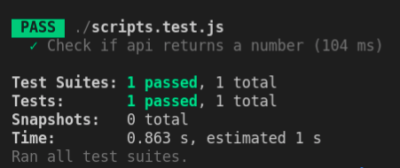

# Internship Exercise
### Currency Converter with rate from the [NBP Web API](http://api.nbp.pl/api/exchangerates/rates/a/gbp/?format=json)


## Instructions

### a) Check out live version on [Currency Converter](https://jacobwojcik.github.io/Internship_Exercise/)
### b) Run code by yourself

```
git clone https://github.com/jacobwojcik/Internship_Exercise.git
cd Internship_Exercise
```

If you want to run tests:
```
npm install
npm test
```
You should be able to see the output:



Now you can start live server on the local host
